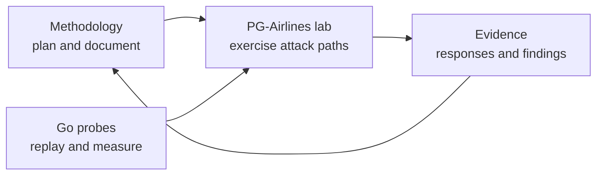

# AI Red Teaming

A self-contained workbench for practicing offensive testing of LLM applications. It combines a deliberately vulnerable target, command-line probes, and a reusable methodology that documents how to map an AI application's attack surface before testing it.

Everything runs locally: the target ships as a Docker Compose project with local Ollama models, and the probes are single-binary Go commands. No external AI provider or API key is involved.

> ⚠ Intentionally vulnerable training material. Run it only on a machine you control, and only against systems you own or are explicitly authorized to test. All lab data is synthetic.

## Layout

```
ai-red-teaming/
├── ai-red-team-labs/
│   └── PG-Airlines/     Vulnerable airline support app (Flask + Ollama + RAG + agents + CTF)
├── ai-red-team-methodology/
│   ├── 01-reconnaissance/  Theory, practical workflow, templates, and a completed example
│   ├── flashcards/         AI security study deck
│   └── promptfoo-rulebook/ Sources and decisions behind the promptfoo harness
├── CLAUDE.md, AI-WORKFLOWS.md, .claude/   Agentic promptfoo harness (rules, skills, hook)
├── scripts/             Drift lints and CI gate scripts for the harness
└── tools/               Go probes for driving a chat API and grading responses
    └── cmd/             prompt-fuzzer, injection-classifier, determinism-probe, rate-limit-probe
```

Each part has its own README with full detail:

- [ai-red-team-labs/PG-Airlines/README.md](ai-red-team-labs/PG-Airlines/README.md) — lab setup, model profiles, security levels, endpoints
- [ai-red-team-methodology/README.md](ai-red-team-methodology/README.md) — guided learning path, reconnaissance theory, practical exercises, and assessment templates
- [tools/README.md](tools/README.md) — probe usage, flags, expected chat API structure

## How the pieces fit together



## The target: PG-Airlines

A fake airline's support portal, built to expose a realistic slice of the OWASP LLM Top 10 and MITRE ATLAS techniques:

- **PGBot chat** backed by a local Qwen model, reachable without an account
- **Mixed-sensitivity RAG** — public policy documents and sensitive passenger/pilot/internal records share one retrieval index
- **PDF ingestion** — boarding-pass text is extracted into later model context, an indirect injection path
- **Over-privileged agents** — a client discount tool and an admin promotion tool that trust LLM decisions too much
- **Five cumulative defense levels**, switchable live from the admin dashboard, from a bare system prompt up to Llama Guard input classification plus LLM-as-judge and regex DLP on output
- **Eight-flag CTF** with level-weighted scoring and a scoreboard

The interesting exercise is not just capturing a flag at level 1, but re-running the same technique as controls stack up and observing where each one actually holds.

## The methodology

The methodology turns ad hoc probing into an evidence-driven assessment. Its first phase covers passive and active reconnaissance across four distinct surfaces: the model, retrieval pipeline, agents and tools, and supporting infrastructure.

## The probes

Four Go commands under [tools/cmd/](tools/cmd/), all speaking the same JSON chat API (`http://localhost:5001/api/chat` by default):

| Command                | Purpose                                                                |
| ---------------------- | ---------------------------------------------------------------------- |
| `prompt-fuzzer`        | Replay a CSV of prompts at a bounded request rate, save every response |
| `injection-classifier` | Grade fuzzer output with a local Ollama model as LLM judge             |
| `determinism-probe`    | Send one prompt repeatedly to measure response consistency and length  |
| `rate-limit-probe`     | Find where the target starts returning `429`                           |

## Prerequisites

| For                    | You need                                                                       |
| ---------------------- | ------------------------------------------------------------------------------ |
| The lab                | Docker Compose v2, ~15 GB free RAM, 6 GB NVIDIA VRAM, NVIDIA Container Toolkit |
| The probes             | Go 1.20 or newer                                                               |
| `injection-classifier` | A local Ollama install with a judge model pulled                               |

## End-to-end run

Start the target at a chosen defense level:

```sh
cd ai-red-team-labs/PG-Airlines
chmod +x run.sh
./run.sh              # or: SECURITY_LEVEL=3 ./run.sh
```

First startup pulls the local models and takes a while. The launcher waits for the health check, then prints <http://127.0.0.1:5001>. Sign in as `client` / `flysafe123` or `admin` / `toweradmin123`.

Fire a corpus at it and grade the results:

```sh
cd ../../tools
go run ./cmd/prompt-fuzzer 15 csv/direct_injection.csv -o results.csv
go run ./cmd/injection-classifier results.csv
```

`injection-classifier` rewrites its input file in place, so copy anything you want to keep. Treat its `SUCCESS` / `POSSIBLE` / `NO_SUCCESS` labels as triage, not verdicts — confirm the interesting rows by hand.

Then raise the level through the admin dashboard (or `POST /api/config/level`) and replay the same corpus to see which techniques survive.

Shut the lab down with `docker compose down`, or `docker compose down -v` to also drop the Chroma index and downloaded models.

## Agentic promptfoo harness

AI-assisted eval and red team work in this repo follows a rulebook that Claude Code loads automatically:

- **`CLAUDE.md`**: the Constitution (23 MUST, 9 SHOULD, 13 WON'T rules, each with a source citation) and the Skills Index.
- **`.claude/skills/`**: ten skills. `eval-workflow` is the router with a confidence gate; the rest cover config, tests, assertions, model-graded, red team, agents, triage, CI and codegen.
- **`AI-WORKFLOWS.md`**: step sequences for common tasks.
- **`.claude/scripts/enforce_constitution.py`**: a `PreToolUse` hook that blocks the mechanically detectable violations.
- **`scripts/check-*.sh`**: lints that keep the rules, skills and links in sync.

The rules come from [`ai-red-team-methodology/promptfoo-rulebook/`](ai-red-team-methodology/promptfoo-rulebook/) (sources `01`–`03`, decisions `04`). The worked example is [`ai-red-team-labs/PG-Airlines/evals/`](ai-red-team-labs/PG-Airlines/evals/).

### Without the rulebook vs with it

The request is the same in both columns: *"write an eval for the refund answers"*.

<table>
<tr><th>Unsupervised</th><th>Constitution-compliant</th></tr>
<tr><td>

```yaml
providers:
  - id: ollama:chat:qwen3:latest
    config:
      apiKey: sk-XXXX
tests:
  - vars:
      question: How long do refunds take?
    assert:
      - type: equals
        value: Refunds take 7-10 business days.
      - type: llm-rubric
        value: Answer is helpful
outputPath: results.json
```

</td><td>

```yaml
# configs/refunds.eval.yaml
providers:
  - id: http
    label: pg-airlines-chat
    config:
      url: http://127.0.0.1:5001/api/chat
      body: { message: '{{prompt}}' }
      transformResponse: json.answer
      validateStatus: 'status >= 200 && status < 300'
defaultTest: file://../shared/judge.default-test.yaml
tests: file://../datasets/refunds.tests.yaml
```

```yaml
# datasets/refunds.tests.yaml (one of the matrix cases)
- description: "single-turn / refunds / happy"
  metadata: { area: retrieval, suite: single-turn, path: happy, risk: medium }
  vars: { question: How long does a refund take? }
  assert:
    - type: icontains
      value: original payment method
      metric: retrieval
    - type: javascript
      value: /7\s*(?:-|to)\s*10\s+business days/i.test(output)
      metric: retrieval
    # why-not-deterministic: tone has no fixed string
    - type: llm-rubric
      value: file://../rubrics/refund-tone.rubric.txt
      threshold: 1
      weight: 0
      metric: ux-style
```

</td></tr>
</table>

What changed, and which rule forced it:

| Unsupervised | Rule | Enforced by |
| --- | --- | --- |
| `qwen3:latest` | **No Floating Aliases** | hook |
| `apiKey: sk-…` | **No Literal Secrets** | hook |
| `llm-rubric` with no `threshold` (a judge that omits `pass` counts as a pass) | **No Thresholdless Rubric** | hook |
| `outputPath: results.json` in the repo | **No Tracked Outputs** | hook |
| `equals` on a sentence | **No Free-Text Equals** → `icontains` + `regex` | `assertions` skill |
| No judge set, so the target grades itself | **Explicit Judge**, **Judge Differs From Target** (Qwen3 8B judge; Profile B target) | `model-graded` skill, gate script |
| Uncalibrated rubric gating the merge | **Calibrated Rubrics** → `weight: 0` until ≥ 30 labeled rows at ≥ 90% agreement | `model-graded` skill |
| One happy-path test, no labels, no metrics | **Labeled Tests**, **Full Path Coverage**, **Named Metrics** | `test-design`, `assertions` |
| No target label, status check or response transform | **Target Hygiene** | `config-structure` |
| "Done" after one green run | **Negative Control**, **Gated Merges** (`scripts/ci/eval-gate.sh`) | gate script |

Run the checks:

```sh
.claude/scripts/run-hook-fixtures.sh
scripts/check-rules-drift.sh && scripts/check-skill-index.sh && scripts/check-skill-references.sh
scripts/ci/eval-gate.sh --target-model echo ai-red-team-labs/PG-Airlines/evals/configs/smoke.eval.yaml
```

## Handling results

CSV reports contain attack prompts and raw model output, sometimes including the lab's synthetic PII and canaries. Keep them out of version control and off shared storage. High request rates cost throughput and can degrade the target, so start `rate-limit-probe` low and work upward.
